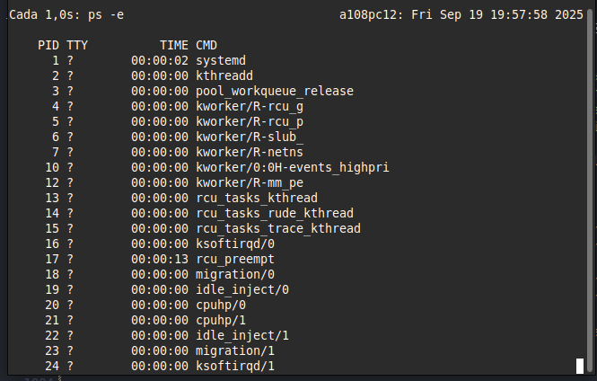

# Ejecución y comprensión de procesos en linux

## Bloque 1

1. Define qué es un proceso y en qué se diferencia de un programa  
   Un proceso es un programa en ejecucion y un programa son las intrucciones para que el dispositivo sepa que hacer con los datos entregados.  
2. Explica qué es el kernel y su papel en la gestión de procesos.  
    El kernel se encarga de gestionar los recursos de los procesos, parar los mismos y decidir su orden de ejecucion  
3. ¿Qué son PID y PPID? Explica con un ejemplo.  
    PID es el id del proceso y el PPID es el id del proceso padre.  
4. Describe qué es un cambio de contexto y por qué es costoso.  
    Porque hay que guardar mucha informacion para ello.  
5. Explica qué es un PCB (Process Control Block) y qué información almacena.  
    Es un registro que guarda la informacion y el estado de los procesos antes de cerrarlos.  
6. Diferencia entre proceso padre y proceso hijo.  
   Los procesos padre son procesos que crean procesos cuando se inician, mientras que los procesos hijo son los procesos creados por otros procesos cuando se inicia el sistema.
7. Explica qué ocurre cuando un proceso queda huérfano en Linux.  
   Pasan a ser "adoptados" por el proceso init.  
8. ¿Qué es un proceso zombie? Da un ejemplo de cómo puede ocurrir.  
   Es un proceso que ha terminado pero que sigue apareciendo en la tabla de procesos, porque el proceso padre no ha registrado el fin del proceso. Si hay muchos procesos zombies estos siguen consumiendo recursos y probocan que el sistema vaya más lento.
9. Diferencia entre concurrencia y paralelismo.  
    La concurrencia es la capacidad del CPU para procesar más de un proceso al mismo tiempo, mientras el paralelismo es tomar un único problema, y mediante concurrencia llegar a una solución más rápido.  
10. Explica qué es un hilo (thread) y en qué se diferencia de un proceso.  
    Los hilos estan dentro de los procesos, compartiendo memoria y recursos, permitiendo a los pocesos realizar multiples tareas a la vez. Un hilo es diferente a un proceso en que los hilos dependen de un proceso pero los procesos pueden ser independientes; los hilos comparten espacio de memoria en los procesos, pero estos tienen su propio espacio de memoria; y la comunicacion entre hilos es más rapida que entre procesos.

## Bloque 2

11. Usa echo $$ para mostrar el PID del proceso actual.  
49229
12. Usa echo $PPID para mostrar el PID del proceso padre.  
49220
13. Ejecuta pidof systemd y explica el resultado.  
3313 nos dice el nombre de todos los procesos asociados a systemd
14. Abre un programa gráfico (ejemplo: gedit) y usa pidof para obtener sus PID.  
    xed  
    pidof xed  
    80788

15. Ejecuta ps -e y explica qué significan sus columnas.  

    ```bash
    PID TTY          TIME CMD
      1 ?        00:00:01 systemd
      2 ?        00:00:00 kthreadd
    ```
    PID es el id del proceso, TTY es la terminal que esta ejecutando el proceso, TIME es el tiempo que lleva ejecutandose, CMD el comando que lo inicio.  

16. Ejecuta ps -f y observa la relación entre procesos padre e hijo.  

    ```bash
        UID          PID    PPID  C STIME TTY          TIME CMD
        dam        49229   49220  0 15:22 pts/0    00:00:00 bash
        dam        90424   49229 99 16:11 pts/0    00:00:00 ps -f
    ```

17. Usa ps -axf o pstree para mostrar el árbol de procesos y dibújalo.

    ```bash
        PID TTY      STAT   TIME COMMAND
        2 ?        S      0:00 [kthreadd]
        3 ?        S      0:00  \_ [pool_workqueue_release]
        4 ?        I<     0:00  \_ [kworker/R-rcu_g]
        5 ?        I<     0:00  \_ [kworker/R-rcu_p]
        6 ?        I<     0:00  \_ [kworker/R-slub_]
        7 ?        I<     0:00  \_ [kworker/R-netns]
       10 ?        I<     0:00  \_ [kworker/0:0H-events_highpri]
        12 ?        I<     0:00  \_ [kworker/R-mm_pe]
        13 ?        I      0:00  \_ [rcu_tasks_kthread]
        14 ?        I      0:00  \_ [rcu_tasks_rude_kthread]
        15 ?        I      0:00  \_ [rcu_tasks_trace_kthread]
        16 ?        S      0:00  \_ [ksoftirqd/0]
        17 ?        I      0:03  \_ [rcu_preempt]
        18 ?        S      0:00  \_ [migration/0]
        19 ?        S      0:00  \_ [idle_inject/0]
        20 ?        S      0:00  \_ [cpuhp/0]
        21 ?        S      0:00  \_ [cpuhp/1]
        22 ?        S      0:00  \_ [idle_inject/1]
        23 ?        S      0:00  \_ [migration/1]
        24 ?        S      0:00  \_ [ksoftirqd/1]
        26 ?        I<     0:00  \_ [kworker/1:0H-events_highpri]
        27 ?        S      0:00  \_ [cpuhp/2]
        28 ?        S      0:00  \_ [idle_inject/2]
        29 ?        S      0:00  \_ [migration/2]
        30 ?        S      0:00  \_ [ksoftirqd/2]
        32 ?        I<     0:00  \_ [kworker/2:0H-events_highpri]
        33 ?        S      0:00  \_ [cpuhp/3]
        34 ?        S      0:00  \_ [idle_inject/3]
        35 ?        S      0:00  \_ [migration/3]
        36 ?        S      0:00  \_ [ksoftirqd/3]
        38 ?        I<     0:00  \_ [kworker/3:0H-events_highpri]
        39 ?        S      0:00  \_ [cpuhp/4]
        40 ?        S      0:00  \_ [idle_inject/4]
        41 ?        S      0:00  \_ [migration/4]
        42 ?        S      0:00  \_ [ksoftirqd/4]
        44 ?        I<     0:00  \_ [kworker/4:0H-events_highpri]
        45 ?        S      0:00  \_ [cpuhp/5]
        46 ?        S      0:00  \_ [idle_inject/5]
        47 ?        S      0:00  \_ [migration/5]
        48 ?        S      0:00  \_ [ksoftirqd/5]
        50 ?        I<     0:00  \_ [kworker/5:0H-events_highpri]
        51 ?        S      0:00  \_ [cpuhp/6]
        52 ?        S      0:00  \_ [idle_inject/6]
        53 ?        S      0:00  \_ [migration/6]
        54 ?        S      0:00  \_ [ksoftirqd/6]
        56 ?        I<     0:00  \_ [kworker/6:0H-events_highpri]
        57 ?        S      0:00  \_ [cpuhp/7]
        58 ?        S      0:00  \_ [idle_inject/7]
        59 ?        S      0:00  \_ [migration/7]
        60 ?        S      0:00  \_ [ksoftirqd/7]
        62 ?        I<     0:00  \_ [kworker/7:0H-events_highpri]
        63 ?        S      0:00  \_ [cpuhp/8]
        64 ?        S      0:00  \_ [idle_inject/8]
        65 ?        S      0:00  \_ [migration/8]
        66 ?        S      0:00  \_ [ksoftirqd/8]
        68 ?        I<     0:00  \_ [kworker/8:0H-events_highpri]
        69 ?        S      0:00  \_ [cpuhp/9]
        70 ?        S      0:00  \_ [idle_inject/9]
        71 ?        S      0:00  \_ [migration/9]
        72 ?        S      0:00  \_ [ksoftirqd/9]
        74 ?        I<     0:00  \_ [kworker/9:0H-events_highpri]
        75 ?        S      0:00  \_ [cpuhp/10]
        76 ?        S      0:00  \_ [idle_inject/10]
        77 ?        S      0:00  \_ [migration/10]
        78 ?        S      0:00  \_ [ksoftirqd/10]
        80 ?        I<     0:00  \_ [kworker/10:0H-events_highpri]
        81 ?        S      0:00  \_ [cpuhp/11]
        82 ?        S      0:00  \_ [idle_inject/11]
        83 ?        S      0:00  \_ [migration/11]
        84 ?        S      0:00  \_ [ksoftirqd/11]
        86 ?        I<     0:00  \_ [kworker/11:0H-events_highpri]
        89 ?        S      0:00  \_ [kdevtmpfs]
        90 ?        I<     0:00  \_ [kworker/R-inet_]
        92 ?        S      0:00  \_ [kauditd]
        95 ?        I      0:00  \_ [kworker/1:2-events]
        96 ?        S      0:00  \_ [khungtaskd]
        98 ?        S      0:00  \_ [oom_reaper]
        99 ?        I<     0:00  \_ [kworker/R-write]
        100 ?        S      0:00  \_ [kcompactd0]
        101 ?        SN     0:00  \_ [ksmd]
        102 ?        SN     0:00  \_ [khugepaged]
        103 ?        I<     0:00  \_ [kworker/R-kinte]
        104 ?        I<     0:00  \_ [kworker/R-kbloc]
        105 ?        I<     0:00  \_ [kworker/R-blkcg]
        106 ?        S      0:00  \_ [irq/9-acpi]
        109 ?        I<     0:00  \_ [kworker/R-tpm_d]
        110 ?        I<     0:00  \_ [kworker/R-ata_s]
        111 ?        I<     0:00  \_ [kworker/R-md]
        112 ?        I<     0:00  \_ [kworker/R-md_bi]
        113 ?        I<     0:00  \_ [kworker/R-edac-]
        115 ?        I<     0:00  \_ [kworker/R-devfr]
        116 ?        S      0:00  \_ [watchdogd]
        117 ?        I<     0:00  \_ [kworker/2:1H-kblockd]
        118 ?        S      0:00  \_ [kswapd0]
        119 ?        S      0:00  \_ [ecryptfs-kthread]
        120 ?        I<     0:00  \_ [kworker/R-kthro]
        129 ?        I<     0:00  \_ [kworker/R-acpi_]
        132 ?        I<     0:00  \_ [kworker/R-mld]
        133 ?        I<     0:00  \_ [kworker/R-ipv6_]
        135 ?        I<     0:00  \_ [kworker/3:1H-kblockd]
        143 ?        I<     0:00  \_ [kworker/R-kstrp]
        145 ?        I<     0:00  \_ [kworker/u67:0]
        152 ?        I<     0:00  \_ [kworker/R-crypt]
        162 ?        I<     0:00  \_ [kworker/R-charg]
        191 ?        I<     0:00  \_ [kworker/11:1H-kblockd]
        195 ?        I<     0:00  \_ [kworker/8:1H-kblockd]
        205 ?        I<     0:00  \_ [kworker/6:1H-kblockd]
        207 ?        I<     0:00  \_ [kworker/4:1H-kblockd]
        215 ?        I<     0:00  \_ [kworker/10:1H-kblockd]
        216 ?        I<     0:00  \_ [kworker/5:1H-kblockd]
        221 ?        I<     0:00  \_ [kworker/1:1H-kblockd]
        224 ?        I<     0:00  \_ [kworker/7:1H-kblockd]
        225 ?        I<     0:00  \_ [kworker/0:1H-kblockd]
        229 ?        S      0:00  \_ [scsi_eh_0]
        230 ?        I<     0:00  \_ [kworker/R-scsi_]
        232 ?        S      0:00  \_ [scsi_eh_1]
        234 ?        I<     0:00  \_ [kworker/R-scsi_]
        235 ?        S      0:00  \_ [scsi_eh_2]
        237 ?        I<     0:00  \_ [kworker/R-scsi_]
        238 ?        S      0:00  \_ [scsi_eh_3]
        240 ?        I<     0:00  \_ [kworker/R-scsi_]
        241 ?        S      0:00  \_ [scsi_eh_4]
        242 ?        I<     0:00  \_ [kworker/R-scsi_]
        243 ?        S      0:00  \_ [scsi_eh_5]
        244 ?        I<     0:00  \_ [kworker/R-scsi_]
        245 ?        S      0:00  \_ [scsi_eh_6]
        246 ?        I<     0:00  \_ [kworker/R-scsi_]
        248 ?        S      0:00  \_ [scsi_eh_7]
        249 ?        I<     0:00  \_ [kworker/R-scsi_]
        257 ?        S      0:00  \_ [scsi_eh_8]
        258 ?        I<     0:00  \_ [kworker/R-scsi_]
        259 ?        S      0:00  \_ [scsi_eh_9]
        260 ?        I<     0:00  \_ [kworker/R-scsi_]
        263 ?        S      0:00  \_ [scsi_eh_10]
        264 ?        I<     0:00  \_ [kworker/R-scsi_]
        268 ?        I<     0:00  \_ [kworker/9:1H-kblockd]
        289 ?        I      0:00  \_ [kworker/4:2-events]
        296 ?        S      0:00  \_ [scsi_eh_11]
        297 ?        I<     0:00  \_ [kworker/R-scsi_]
        298 ?        S      0:00  \_ [usb-storage]
        299 ?        I<     0:00  \_ [kworker/R-uas]
        330 ?        I<     0:00  \_ [kworker/R-raid5]
        381 ?        S      0:00  \_ [jbd2/sdb3-8]
        382 ?        I<     0:00  \_ [kworker/R-ext4-]
        475 ?        I<     0:00  \_ [kworker/R-rpcio]
        476 ?        I<     0:00  \_ [kworker/R-xprti]
        480 ?        I<     0:00  \_ [kworker/R-nvme-]
        481 ?        I<     0:00  \_ [kworker/R-nvme-]
        482 ?        I<     0:00  \_ [kworker/R-nvme-]
        483 ?        I<     0:00  \_ [kworker/R-nvme-]
        531 ?        S      0:00  \_ [psimon]
        890 ?        S      0:00  \_ [jbd2/sda1-8]
        891 ?        I<     0:00  \_ [kworker/R-ext4-]
        903 ?        I      0:00  \_ [kworker/5:3-events]
        915 ?        I<     0:00  \_ [kworker/R-amdgp]
        919 ?        S      0:00  \_ [jbd2/sdb4-8]
        920 ?        I<     0:00  \_ [kworker/R-ext4-]
        922 ?        I<     0:00  \_ [kworker/R-ttm]
        924 ?        I<     0:00  \_ [kworker/R-amdgp]
        925 ?        I<     0:00  \_ [kworker/R-amdgp]
        926 ?        I<     0:00  \_ [kworker/R-amdgp]
        927 ?        I<     0:00  \_ [kworker/R-dm_vb]
        928 ?        S      0:00  \_ [card1-crtc0]
        929 ?        S      0:00  \_ [card1-crtc1]
        930 ?        S      0:00  \_ [card1-crtc2]
        931 ?        S      0:00  \_ [card1-crtc3]
        943 ?        S<     0:00  \_ [spl_system_task]
        944 ?        S<     0:00  \_ [spl_delay_taskq]
        945 ?        S<     0:00  \_ [spl_dynamic_tas]
        946 ?        S<     0:00  \_ [spl_kmem_cache]
        948 ?        S<     0:00  \_ [zvol]
        949 ?        S      0:00  \_ [arc_prune]
        950 ?        S      0:00  \_ [arc_evict]
        951 ?        SN     0:00  \_ [arc_reap]
        952 ?        S      0:00  \_ [dbu_evict]
        953 ?        SN     0:00  \_ [dbuf_evict]
        954 ?        SN     0:00  \_ [z_vdev_file]
        955 ?        S      0:00  \_ [l2arc_feed]
        1974 ?        S      0:00  \_ [psimon]
        2182 ?        I<     0:00  \_ [kworker/R-ipmi-]
        2190 ?        I      0:00  \_ [lockd]
        2204 ?        I<     0:00  \_ [kworker/R-iprt-]
        2210 ?        S      0:00  \_ [iprt-VBoxTscThread]
        2234 ?        I      0:00  \_ [nfsd]
        2235 ?        I      0:00  \_ [nfsd]
        2236 ?        I      0:00  \_ [nfsd]
        2237 ?        I      0:00  \_ [nfsd]
        2238 ?        I      0:00  \_ [nfsd]
        2239 ?        I      0:00  \_ [nfsd]
        2240 ?        I      0:00  \_ [nfsd]
        2241 ?        I      0:00  \_ [nfsd]
        2470 ?        I<     0:00  \_ [kworker/u69:2-ttm]
        12247 ?        I      0:00  \_ [kworker/u65:4-events_power_efficient]
        20722 ?        I      0:00  \_ [kworker/0:0-events]
        35940 ?        D      0:00  \_ [kworker/u66:0+events_unbound]
        36662 ?        I      0:00  \_ [kworker/9:0-mm_percpu_wq]
        40748 ?        I      0:00  \_ [kworker/11:2-events]
        41333 ?        I      0:00  \_ [kworker/2:2-events]
        43215 ?        I      0:00  \_ [kworker/7:2-rcu_par_gp]
        43513 ?        I      0:00  \_ [kworker/3:0-events]
        43713 ?        I      0:00  \_ [kworker/8:1-events]
        43818 ?        I      0:00  \_ [kworker/10:1-events]
        50442 ?        I      0:00  \_ [kworker/2:0-events]
        50490 ?        I      0:00  \_ [kworker/6:0-events]
        53453 ?        I      0:00  \_ [kworker/u65:0-events_unbound]
        63907 ?        I<     0:00  \_ [kworker/u68:1-ttm]
        66764 ?        I      0:00  \_ [kworker/u65:1-events_power_efficient]
        69474 ?        I      0:00  \_ [kworker/8:2-rcu_par_gp]
        74038 ?        I      0:01  \_ [kworker/u64:0-gfx_low]
        76794 ?        I      0:00  \_ [kworker/10:0-events]
        81890 ?        I      0:00  \_ [kworker/u66:2-writeback]
        81948 ?        I      0:00  \_ [kworker/11:0-events]
        81949 ?        I      0:00  \_ [kworker/u66:3-events_unbound]
        82149 ?        I      0:00  \_ [kworker/4:0-events]
        82166 ?        I<     0:00  \_ [kworker/u69:0-ttm]
        83036 ?        I      0:00  \_ [kworker/6:2-rcu_gp]
        83071 ?        I      0:00  \_ [kworker/1:1]
        83119 ?        I      0:00  \_ [kworker/7:0-mm_percpu_wq]
        83847 ?        I      0:00  \_ [kworker/9:1]
        83883 ?        I<     0:00  \_ [kworker/u68:0-ttm]
        84118 ?        I      0:00  \_ [kworker/5:0-events]
        84124 ?        I      0:00  \_ [kworker/3:2-rcu_par_gp]
        84497 ?        I      0:00  \_ [kworker/0:1-events]
        84498 ?        I      0:00  \_ [kworker/8:0]
        85824 ?        I      0:00  \_ [kworker/u64:2-gfx_low]
        85871 ?        I      0:00  \_ [kworker/u65:2]
        88033 ?        I      0:00  \_ [kworker/6:1-rcu_par_gp]
        88034 ?        I      0:00  \_ [kworker/7:1-rcu_par_gp]
        88785 ?        I      0:00  \_ [kworker/u66:1-events_unbound]
        89066 ?        I<     0:00  \_ [kworker/u69:1]
        90844 ?        I      0:00  \_ [kworker/u64:1-gfx_low]
        1 ?        Ss     0:01 /sbin/init splash
        442 ?        S<s    0:00 /usr/lib/systemd/systemd-journald
        528 ?        Ss     0:00 /usr/lib/systemd/systemd-udevd
        1063 ?        Ss     0:00 /sbin/rpcbind -f -w
        1075 ?        Ss     0:00 /usr/lib/systemd/systemd-resolved
        1088 ?        Ssl    0:00 /usr/lib/systemd/systemd-timesyncd
        1106 ?        Ss     0:00 /usr/sbin/blkmapd
        1134 ?        Ss     0:00 /usr/sbin/nfsdcld
        1151 ?        Ssl    0:00 /usr/libexec/accounts-daemon
        1157 ?        Ss     0:00 avahi-daemon: running [a108pc12.local]
        1250 ?        S      0:00  \_ avahi-daemon: chroot helper
        1159 ?        Ss     0:00 @dbus-daemon --system --address=systemd: --nofork -
        1162 ?        Ss     0:00 /usr/sbin/fsidd
        1166 ?        Ssl    0:00 /usr/sbin/irqbalance
        1202 ?        Ssl    0:00 /usr/lib/polkit-1/polkitd --no-debug
        1203 ?        Ssl    0:00 /usr/libexec/power-profiles-daemon
        1209 ?        Ssl    0:00 /usr/bin/prometheus-node-exporter
        1213 ?        Ss     0:00 /usr/sbin/smartd -n
        1221 ?        Ssl    0:00 /usr/libexec/switcheroo-control
        1222 ?        Ss     0:00 /usr/lib/systemd/systemd-logind
        1223 ?        Ss     0:00 /usr/lib/systemd/systemd-machined
        1228 ?        Ssl    0:01 /usr/bin/touchegg --daemon
        1236 ?        Ssl    0:00 /usr/libexec/udisks2/udisksd
        1241 ?        Ss     0:00 /usr/sbin/virtlockd
        1242 ?        Ss     0:00 /usr/sbin/virtlogd
        1244 ?        Ssl    0:00 zed -F
        1258 ?        Ssl    0:00 /usr/sbin/rsyslogd -n -iNONE
        1819 ?        Ssl    0:01 /usr/sbin/NetworkManager --no-daemon
        1825 ?        Ss     0:00 /usr/sbin/wpa_supplicant -u -s -O DIR=/run/wpa_supp
        1851 ?        Ssl    0:00 /usr/sbin/ModemManager
        1983 ?        Ss     0:00 /usr/sbin/cupsd -l
        1996 ?        Ssl    0:01 /usr/bin/containerd
        2016 ?        Ssl    0:00 /usr/libexec/colord
        2028 ?        Ss     0:00 /usr/sbin/winbindd --foreground --no-process-group
        2040 ?        S      0:00  \_ winbindd: domain child [A108PC12]
        2103 ?        Ssl    0:00 /usr/sbin/cups-browsed
        2104 ?        Ssl    0:06 /usr/bin/dockerd -H fd:// --containerd=/run/contain
        3232 ?        Sl     0:00  \_ /usr/bin/docker-proxy -proto tcp -host-ip 0.0.0
        3238 ?        Sl     0:00  \_ /usr/bin/docker-proxy -proto tcp -host-ip :: -h
        12391 ?        Sl     0:00  \_ /usr/bin/docker-proxy -proto tcp -host-ip 0.0.0
        12398 ?        Sl     0:00  \_ /usr/bin/docker-proxy -proto tcp -host-ip :: -h
        2105 ?        Ss     0:00 socat -T 60 openssl-connect:server:789,cafile=/etc/
        2115 ?        Ss     0:00 /usr/sbin/cron -f -P
        2117 ?        Ss     0:00 /usr/sbin/rpc.idmapd
        2126 ?        Ss     0:00 /usr/sbin/rpc.statd
        2132 ?        Ss     0:00 /usr/sbin/rpc.mountd
        2165 ?        Ss     0:00 /usr/sbin/kerneloops --test
        2175 ?        Ss     0:00 /usr/sbin/kerneloops
        2178 ?        SLsl   0:00 /usr/sbin/lightdm
        2227 tty7     Ssl+   1:04  \_ /usr/lib/xorg/Xorg -core :0 -seat seat0 -auth /
        3302 ?        Sl     0:00  \_ lightdm --session-child 13 24
        3355 ?        Ssl    0:00      \_ /usr/lib/x86_64-linux-gnu/cinnamon-session-
        3569 ?        Sl     0:00          \_ /usr/bin/csd-automount
        3570 ?        Sl     0:00          \_ /usr/bin/csd-settings-remap
        3571 ?        Sl     0:00          \_ /usr/bin/csd-power
        3573 ?        Sl     0:00          \_ /usr/bin/csd-housekeeping
        3574 ?        Sl     0:00          \_ /usr/bin/csd-wacom
        3575 ?        Sl     0:00          \_ /usr/bin/csd-color
        3576 ?        Sl     0:00          \_ /usr/bin/csd-background
        3580 ?        Sl     0:00          \_ /usr/libexec/at-spi-bus-launcher --laun
        3592 ?        S      0:00          |   \_ /usr/bin/dbus-daemon --config-file=
        3581 ?        Sl     0:00          \_ /usr/bin/csd-screensaver-proxy
        3585 ?        Sl     0:00          \_ /usr/bin/csd-xsettings
        3591 ?        Sl     0:00          \_ /usr/bin/csd-keyboard
        3593 ?        Sl     0:00          \_ /usr/bin/csd-media-keys
        3594 ?        Sl     0:00          \_ /usr/bin/csd-clipboard
        3595 ?        Sl     0:00          \_ /usr/bin/csd-print-notifications
        3597 ?        Sl     0:00          \_ /usr/bin/csd-a11y-settings
        3739 ?        Sl     0:00          \_ cinnamon-launcher
        3743 ?        Sl     2:07          |   \_ cinnamon --replace
        4006 ?        Sl     4:24          |       \_ /usr/lib/firefox/firefox --priv
        4011 ?        Sl     0:00          |           \_ /usr/lib/firefox/crashhelpe
        4099 ?        Sl     0:00          |           \_ /usr/lib/firefox/firefox-bi
        4160 ?        Sl     0:03          |           \_ /usr/lib/firefox/firefox-bi
        4166 ?        Sl     0:00          |           \_ /usr/lib/firefox/firefox-bi
        4228 ?        Sl     0:08          |           \_ /usr/lib/firefox/firefox-bi
        4284 ?        Sl     0:00          |           \_ /usr/lib/firefox/firefox-bi
        4292 ?        Sl     0:12          |           \_ /usr/lib/firefox/firefox-bi
        4295 ?        Sl     0:14          |           \_ /usr/lib/firefox/firefox-bi
        4414 ?        Sl     0:10          |           \_ /usr/lib/firefox/firefox-bi
        5044 ?        Sl     0:02          |           \_ /usr/lib/firefox/firefox-bi
        28901 ?        Sl     0:33          |           \_ /usr/lib/firefox/firefox-bi
        84132 ?        Sl     0:00          |           \_ /usr/lib/firefox/firefox-bi
        84214 ?        Sl     0:09          |           \_ /usr/lib/firefox/firefox-bi
        84440 ?        Sl     0:06          |           \_ /usr/lib/firefox/firefox-bi
        84915 ?        Sl     0:01          |           \_ /usr/lib/firefox/firefox-bi
        85909 ?        Sl     0:02          |           \_ /usr/lib/firefox/firefox-bi
        86588 ?        Sl     0:01          |           \_ /usr/lib/firefox/firefox-bi
        88894 ?        Sl     0:00          |           \_ /usr/lib/firefox/firefox-bi
        89141 ?        Sl     0:00          |           \_ /usr/lib/firefox/firefox-bi
        89155 ?        Sl     0:00          |           \_ /usr/lib/firefox/firefox-bi
        3776 ?        Sl     0:00          \_ /usr/lib/x86_64-linux-gnu/xapps/xapp-sn
        3800 ?        Sl     0:00          \_ /usr/libexec/geoclue-2.0/demos/agent
        3811 ?        S      0:00          \_ socat -T 60 openssl-connect:server:789,
        3815 ?        Sl     0:00          \_ /usr/bin/nemo-desktop
        3823 ?        Sl     0:00          \_ /usr/libexec/evolution-data-server/evol
        3825 ?        Sl     0:00          \_ cinnamon-killer-daemon
        3826 ?        Sl     0:00          \_ /usr/bin/python3 /usr/bin/blueman-apple
        4513 ?        S      0:00          \_ /usr/bin/python3 /usr/share/system-conf
        2233 tty1     Ss+    0:00 /sbin/agetty -o -p -- \u --noclear - linux
        2287 ?        Ss     0:00 /usr/sbin/apache2 -k start
        2303 ?        S      0:00  \_ /usr/sbin/apache2 -k start
        2304 ?        S      0:00  \_ /usr/sbin/apache2 -k start
        2305 ?        S      0:00  \_ /usr/sbin/apache2 -k start
        2307 ?        S      0:00  \_ /usr/sbin/apache2 -k start
        2308 ?        S      0:00  \_ /usr/sbin/apache2 -k start
        2344 ?        S      0:00 /usr/sbin/dnsmasq --conf-file=/var/lib/libvirt/dnsm
        2345 ?        S      0:00  \_ /usr/sbin/dnsmasq --conf-file=/var/lib/libvirt/
        2433 ?        SNsl   0:00 /usr/libexec/rtkit-daemon
        2649 ?        Ssl    0:00 /usr/libexec/upowerd
        3136 ?        Sl     0:00 /usr/bin/containerd-shim-runc-v2 -namespace moby -i
        3160 ?        Ss     0:00  \_ apache2 -DFOREGROUND
        3272 ?        S      0:00      \_ apache2 -DFOREGROUND
        3273 ?        S      0:00      \_ apache2 -DFOREGROUND
        3274 ?        S      0:00      \_ apache2 -DFOREGROUND
        3275 ?        S      0:00      \_ apache2 -DFOREGROUND
        3276 ?        S      0:00      \_ apache2 -DFOREGROUND
        3313 ?        Ss     0:00 /usr/lib/systemd/systemd --user
        3314 ?        S      0:00  \_ (sd-pam)
        3323 ?        S<sl   0:00  \_ /usr/bin/pipewire
        3324 ?        Ssl    0:00  \_ /usr/bin/pipewire -c filter-chain.conf
        3326 ?        Ss     0:00  \_ /usr/bin/python3 /usr/bin/powerline-daemon --fo
        3327 ?        S<sl   0:00  \_ /usr/bin/wireplumber
        3328 ?        S<sl   0:00  \_ /usr/bin/pipewire-pulse
        3329 ?        SLsl   0:00  \_ /usr/bin/gnome-keyring-daemon --foreground --co
        3330 ?        Ss     0:00  \_ /usr/bin/dbus-daemon --session --address=system
        3602 ?        Ssl    0:00  \_ /usr/libexec/dconf-service
        3640 ?        Ssl    0:00  \_ /usr/libexec/gvfsd
        3980 ?        Sl     0:00  |   \_ /usr/libexec/gvfsd-trash --spawner :1.31 /o
        3650 ?        Sl     0:00  \_ /usr/libexec/gvfsd-fuse /run/user/1001/gvfs -f
        3691 ?        Ssl    0:00  \_ /usr/libexec/gvfs-udisks2-volume-monitor
        3702 ?        Ssl    0:00  \_ /usr/libexec/gvfs-gphoto2-volume-monitor
        3707 ?        Ssl    0:00  \_ /usr/libexec/gvfs-goa-volume-monitor
        3712 ?        Sl     0:00  \_ /usr/libexec/goa-daemon
        3720 ?        Sl     0:00  \_ /usr/libexec/goa-identity-service
        3726 ?        Ssl    0:00  \_ /usr/libexec/gvfs-mtp-volume-monitor
        3732 ?        Ssl    0:00  \_ /usr/libexec/gvfs-afc-volume-monitor
        3896 ?        Ssl    0:00  \_ /usr/libexec/evolution-source-registry
        3905 ?        Ss     0:00  \_ /usr/libexec/bluetooth/obexd
        3936 ?        Ssl    0:00  \_ /usr/libexec/evolution-calendar-factory
        3951 ?        Ssl    0:00  \_ /usr/libexec/evolution-addressbook-factory
        3993 ?        Ssl    0:00  \_ /usr/libexec/gvfsd-metadata
        4102 ?        Ssl    0:00  \_ /usr/libexec/xdg-desktop-portal
        4122 ?        Ssl    0:00  \_ /usr/libexec/xdg-document-portal
        4133 ?        Ss     0:00  |   \_ fusermount3 -o rw,nosuid,nodev,fsname=porta
        4126 ?        Ssl    0:00  \_ /usr/libexec/xdg-permission-store
        4138 ?        Ssl    0:00  \_ /usr/libexec/xdg-desktop-portal-xapp
        4146 ?        Ssl    0:00  \_ /usr/libexec/xdg-desktop-portal-gtk
        5165 ?        SLsl   0:32  \_ /usr/share/code/code acceso-a-datos/
        5174 ?        S      0:00  |   \_ /usr/share/code/code --type=zygote --no-zyg
        5213 ?        Sl     1:30  |   |   \_ /usr/share/code/code --type=gpu-process
        5175 ?        S      0:00  |   \_ /usr/share/code/code --type=zygote
        5177 ?        S      0:00  |   |   \_ /usr/share/code/code --type=zygote
        5252 ?        Sl     3:06  |   |       \_ /usr/share/code/code --type=rendere
        5711 ?        Sl     0:12  |   |       \_ /usr/share/code/code --type=rendere
        6238 ?        Sl     4:00  |   |       \_ /usr/share/code/code --type=rendere
        5217 ?        Sl     0:03  |   \_ /usr/share/code/code --type=utility --utili
        5314 ?        Sl     1:00  |   \_ /usr/share/code/code --type=utility --utili
        5315 ?        Sl     0:01  |   \_ /usr/share/code/code --type=utility --utili
        5347 ?        Sl     0:07  |   \_ /usr/share/code/code --type=utility --utili
        5363 pts/1    Ss     0:00  |   |   \_ /usr/bin/bash --rcfile /home/dam/.confi
        11425 pts/1    Sl+    0:00  |   |       \_ docker compose up --build
        11448 pts/1    Sl+    0:00  |   |           \_ /usr/libexec/docker/cli-plugins
        6257 ?        Sl     0:02  |   \_ /usr/share/code/code --type=utility --utili
        6274 ?        Sl     1:43  |   \_ /usr/share/code/code --type=utility --utili
        6313 ?        Sl     0:00  |   |   \_ /usr/share/code/code /usr/share/code/re
        6480 ?        Sl     0:00  |   |   \_ /usr/share/code/code /home/dam/.vscode/
        6572 ?        Sl     1:31  |   |   \_ /home/dam/.vscode/extensions/sonarsourc
        6625 ?        Sl     0:03  |   |   \_ /usr/share/code/code /usr/share/code/re
        19589 ?        Sl     0:00  |   |   \_ /usr/share/code/code /home/dam/.vscode/
        19590 ?        Sl     0:00  |   |   \_ /usr/share/code/code /home/dam/.vscode/
        87074 ?        Sl     0:00  |   |   \_ docker events --since 1758294501 --unti
        23523 ?        Sl     0:41  |   \_ /usr/share/code/code --type=utility --utili
        23542 ?        Sl     0:00  |       \_ /usr/share/code/code /home/dam/.vscode/
        23543 ?        Sl     0:03  |       \_ /usr/share/code/code /home/dam/.vscode/
        23544 ?        Sl     0:02  |       \_ /home/dam/.vscode/extensions/devsense.i
        23552 ?        Sl     0:00  |       \_ /usr/share/code/code /home/dam/.vscode/
        23560 ?        Sl     0:00  |       \_ /usr/share/code/code /home/dam/.vscode/
        23567 ?        S      0:00  |       \_ PHP Language Server
        23585 ?        S      0:00  |       |   \_ sh -c '/usr/bin/php8.3' '-n' '-c' '
        23586 ?        S      0:00  |       |       \_ PHP Language Server
        23600 ?        Sl     0:00  |       \_ /usr/share/code/code /usr/share/code/re
        23765 ?        Sl     0:00  |       \_ /usr/share/code/code /usr/share/code/re
        23795 ?        Sl     0:00  |       \_ /usr/share/code/code /usr/share/code/re
        23856 ?        Sl     0:06  |       \_ /home/dam/.vscode/extensions/devsense.p
        23868 ?        Sl     0:31  |       \_ /home/dam/.vscode/extensions/sonarsourc
        89776 ?        Sl     0:00  |       \_ docker events --since 1758294671 --unti
        5196 ?        Sl     0:00  \_ /usr/share/code/chrome_crashpad_handler --monit
        49220 ?        Ssl    0:04  \_ /usr/libexec/gnome-terminal-server
        49229 pts/0    Ss     0:00      \_ bash
        91005 pts/0    R+     0:00          \_ ps -axf
        3667 ?        Sl     0:00 /usr/libexec/at-spi2-registryd --use-gnome-session
        3670 ?        Sl     0:00 /usr/libexec/csd-printer
        4456 ?        Sl     0:00 mintUpdate
        4530 ?        Sl     0:26 mintreport-tray
        12294 ?        Sl     0:00 /usr/bin/containerd-shim-runc-v2 -namespace moby -i
        12316 ?        Ss     0:00  \_ apache2 -DFOREGROUND
        12434 ?        S      0:00      \_ apache2 -DFOREGROUND
        12435 ?        S      0:00      \_ apache2 -DFOREGROUND
        12436 ?        S      0:00      \_ apache2 -DFOREGROUND
        12437 ?        S      0:00      \_ apache2 -DFOREGROUND
        12438 ?        S      0:00      \_ apache2 -DFOREGROUND
        16004 ?        S      0:00      \_ apache2 -DFOREGROUND
        50448 ?        Ssl    0:00 /usr/libexec/fwupd/fwupd
        ```
18. Ejecuta top o htop y localiza el proceso con mayor uso de CPU.

    ```bash
        PID USUARIO   PR  NI    VIRT    RES    SHR S  %CPU  %MEM     HORA+ ORDEN    
        4530 dam       20   0  496296  59968  36776 S   1,3   0,2   0:27.17 mintrep+
    ```

19. Ejecuta sleep 100 en segundo plano y busca su PID con ps.

    ```bash
     96550 pts/0    00:00:00 sleep
    ```

20. Finaliza un proceso con kill y comprueba con ps que ya no está.
    ```bash
    $ kill 96550
    [1]+  Terminado               sleep 100
    $ ps
        PID TTY          TIME CMD
    49229 pts/0    00:00:00 bash
    97831 pts/0    00:00:00 ps
    ```

## Bloque 3

21. Identifica el PID del proceso init/systemd y explica su función.

    ```bash
    PID TTY          TIME CMD
      1 ?        00:00:01 systemd
    ```

    Es el primer proceso en iniciarse y gestiona el resto de procesos.
22. Explica qué ocurre con el PPID de un proceso hijo si su padre termina antes.  
    El proceso init pasa a "adoptarlo".

23. Ejecuta un programa que genere varios procesos hijos y observa sus PIDs con ps.  

    ```bash
     dam  ~  xed &
    [1] 138230
     dam  ~  1  xeyes &
    [2] 138358
     dam  ~  2  pstree $$
    bash─┬─pstree
        ├─xed───6*[{xed}]
        └─xeyes
     dam  ~  2  ps -f
    UID          PID    PPID  C STIME TTY          TIME CMD
    dam        49229   49220  0 15:22 pts/0    00:00:00 bash
    dam       138230   49229  0 17:06 pts/0    00:00:00 xed
    dam       138358   49229  0 17:06 pts/0    00:00:00 xeyes
    dam       138723   49229  0 17:06 pts/0    00:00:00 ps -f
    ```

24. Haz que un proceso quede en estado suspendido con Ctrl+Z y réanúdalo con fg.

    ```bash
     dam  ~  1  xeyes 
    ^Z
    [1]+  Detenido                xeyes
     dam  ~  1  SIGTSTP  fg "%xeyes" 
    xeyes
    ```

25. Lanza un proceso en segundo plano con & y obsérvalo con jobs.
    xeyes &
[1] 191299
 dam  ~  Descargas  repos  1  jobs
[1]+  Ejecutando              xeyes &

26. Explica la diferencia entre los estados de un proceso: Running, Sleeping, Zombie, Stopped.  
    Running es que el proceso se está ejecutando
    Sleeping es que esta esperando para ser ejecutado
    Zombie es que no se esta ejecutando pero aun aparece en la tabla de procesos
    Stopped esta esperando que se finalice alguna operacion de entrada salida

27. Usa ps -eo pid,ppid,stat,cmd para mostrar los estados de varios procesos.  

```bash
ps -eo pid,ppid,stat,cmd
    PID    PPID STAT CMD
      1       0 Ss   /sbin/init splash
      2       0 S    [kthreadd]
      3       2 S    [pool_workqueue_release]
      4       2 I<   [kworker/R-rcu_g]
      5       2 I<   [kworker/R-rcu_p]
      6       2 I<   [kworker/R-slub_]
      7       2 I<   [kworker/R-netns]
     10       2 I<   [kworker/0:0H-events_highpri]
     12       2 I<   [kworker/R-mm_pe]
     13       2 I    [rcu_tasks_kthread]
     14       2 I    [rcu_tasks_rude_kthread]
     15       2 I    [rcu_tasks_trace_kthread]
     16       2 S    [ksoftirqd/0]
     17       2 I    [rcu_preempt]
     18       2 S    [migration/0]
     19       2 S    [idle_inject/0]
     20       2 S    [cpuhp/0]
     21       2 S    [cpuhp/1]
     22       2 S    [idle_inject/1]
     23       2 S    [migration/1]
     24       2 S    [ksoftirqd/1]
     26       2 I<   [kworker/1:0H-events_highpri]
     27       2 S    [cpuhp/2]
     28       2 S    [idle_inject/2]
     29       2 S    [migration/2]
     30       2 S    [ksoftirqd/2]
     32       2 I<   [kworker/2:0H-events_highpri]
     33       2 S    [cpuhp/3]
     34       2 S    [idle_inject/3]
     35       2 S    [migration/3]
     36       2 S    [ksoftirqd/3]
     38       2 I<   [kworker/3:0H-events_highpri]
     39       2 S    [cpuhp/4]
     40       2 S    [idle_inject/4]
     41       2 S    [migration/4]
     42       2 S    [ksoftirqd/4]
     44       2 I<   [kworker/4:0H-events_highpri]
     45       2 S    [cpuhp/5]
     46       2 S    [idle_inject/5]
     47       2 S    [migration/5]
     48       2 S    [ksoftirqd/5]
     50       2 I<   [kworker/5:0H-events_highpri]
     51       2 S    [cpuhp/6]
     52       2 S    [idle_inject/6]
     53       2 S    [migration/6]
     54       2 S    [ksoftirqd/6]
     56       2 I<   [kworker/6:0H-events_highpri]
     57       2 S    [cpuhp/7]
     58       2 S    [idle_inject/7]
     59       2 S    [migration/7]
     60       2 S    [ksoftirqd/7]
     62       2 I<   [kworker/7:0H-events_highpri]
     63       2 S    [cpuhp/8]
     64       2 S    [idle_inject/8]
     65       2 S    [migration/8]
     66       2 S    [ksoftirqd/8]
     68       2 I<   [kworker/8:0H-events_highpri]
     69       2 S    [cpuhp/9]
     70       2 S    [idle_inject/9]
     71       2 S    [migration/9]
     72       2 S    [ksoftirqd/9]
     74       2 I<   [kworker/9:0H-events_highpri]
     75       2 S    [cpuhp/10]
     76       2 S    [idle_inject/10]
     77       2 S    [migration/10]
     78       2 S    [ksoftirqd/10]
     80       2 I<   [kworker/10:0H-events_highpri]
     81       2 S    [cpuhp/11]
     82       2 S    [idle_inject/11]
     83       2 S    [migration/11]
     84       2 S    [ksoftirqd/11]
     86       2 I<   [kworker/11:0H-events_highpri]
     89       2 S    [kdevtmpfs]
     90       2 I<   [kworker/R-inet_]
     92       2 S    [kauditd]
     96       2 S    [khungtaskd]
     98       2 S    [oom_reaper]
     99       2 I<   [kworker/R-write]
    100       2 S    [kcompactd0]
    101       2 SN   [ksmd]
    102       2 SN   [khugepaged]
    103       2 I<   [kworker/R-kinte]
    104       2 I<   [kworker/R-kbloc]
    105       2 I<   [kworker/R-blkcg]
    106       2 S    [irq/9-acpi]
    109       2 I<   [kworker/R-tpm_d]
    110       2 I<   [kworker/R-ata_s]
    111       2 I<   [kworker/R-md]
    112       2 I<   [kworker/R-md_bi]
    113       2 I<   [kworker/R-edac-]
    115       2 I<   [kworker/R-devfr]
    116       2 S    [watchdogd]
    117       2 I<   [kworker/2:1H-kblockd]
    118       2 S    [kswapd0]
    119       2 S    [ecryptfs-kthread]
    120       2 I<   [kworker/R-kthro]
    129       2 I<   [kworker/R-acpi_]
    132       2 I<   [kworker/R-mld]
    133       2 I<   [kworker/R-ipv6_]
    135       2 I<   [kworker/3:1H-kblockd]
    143       2 I<   [kworker/R-kstrp]
    145       2 I<   [kworker/u67:0]
    152       2 I<   [kworker/R-crypt]
    162       2 I<   [kworker/R-charg]
    191       2 I<   [kworker/11:1H-kblockd]
    195       2 I<   [kworker/8:1H-kblockd]
    205       2 I<   [kworker/6:1H-kblockd]
    207       2 I<   [kworker/4:1H-kblockd]
    215       2 I<   [kworker/10:1H-kblockd]
    216       2 I<   [kworker/5:1H-kblockd]
    221       2 I<   [kworker/1:1H-kblockd]
    224       2 I<   [kworker/7:1H-kblockd]
    225       2 I<   [kworker/0:1H-kblockd]
    229       2 S    [scsi_eh_0]
    230       2 I<   [kworker/R-scsi_]
    232       2 S    [scsi_eh_1]
    234       2 I<   [kworker/R-scsi_]
    235       2 S    [scsi_eh_2]
    237       2 I<   [kworker/R-scsi_]
    238       2 S    [scsi_eh_3]
    240       2 I<   [kworker/R-scsi_]
    241       2 S    [scsi_eh_4]
    242       2 I<   [kworker/R-scsi_]
    243       2 S    [scsi_eh_5]
    244       2 I<   [kworker/R-scsi_]
    245       2 S    [scsi_eh_6]
    246       2 I<   [kworker/R-scsi_]
    248       2 S    [scsi_eh_7]
    249       2 I<   [kworker/R-scsi_]
    257       2 S    [scsi_eh_8]
    258       2 I<   [kworker/R-scsi_]
    259       2 S    [scsi_eh_9]
    260       2 I<   [kworker/R-scsi_]
    263       2 S    [scsi_eh_10]
    264       2 I<   [kworker/R-scsi_]
    268       2 I<   [kworker/9:1H-kblockd]
    296       2 S    [scsi_eh_11]
    297       2 I<   [kworker/R-scsi_]
    298       2 S    [usb-storage]
    299       2 I<   [kworker/R-uas]
    330       2 I<   [kworker/R-raid5]
    381       2 S    [jbd2/sdb3-8]
    382       2 I<   [kworker/R-ext4-]
    442       1 S<s  /usr/lib/systemd/systemd-journald
    475       2 I<   [kworker/R-rpcio]
    476       2 I<   [kworker/R-xprti]
    480       2 I<   [kworker/R-nvme-]
    481       2 I<   [kworker/R-nvme-]
    482       2 I<   [kworker/R-nvme-]
    483       2 I<   [kworker/R-nvme-]
    528       1 Ss   /usr/lib/systemd/systemd-udevd
    531       2 S    [psimon]
    890       2 S    [jbd2/sda1-8]
    891       2 I<   [kworker/R-ext4-]
    915       2 I<   [kworker/R-amdgp]
    919       2 S    [jbd2/sdb4-8]
    920       2 I<   [kworker/R-ext4-]
    922       2 I<   [kworker/R-ttm]
    924       2 I<   [kworker/R-amdgp]
    925       2 I<   [kworker/R-amdgp]
    926       2 I<   [kworker/R-amdgp]
    927       2 I<   [kworker/R-dm_vb]
    928       2 S    [card1-crtc0]
    929       2 S    [card1-crtc1]
    930       2 S    [card1-crtc2]
    931       2 S    [card1-crtc3]
    943       2 S<   [spl_system_task]
    944       2 S<   [spl_delay_taskq]
    945       2 S<   [spl_dynamic_tas]
    946       2 S<   [spl_kmem_cache]
    948       2 S<   [zvol]
    949       2 S    [arc_prune]
    950       2 S    [arc_evict]
    951       2 SN   [arc_reap]
    952       2 S    [dbu_evict]
    953       2 SN   [dbuf_evict]
    954       2 SN   [z_vdev_file]
    955       2 S    [l2arc_feed]
   1063       1 Ss   /sbin/rpcbind -f -w
   1075       1 Ss   /usr/lib/systemd/systemd-resolved
   1088       1 Ssl  /usr/lib/systemd/systemd-timesyncd
   1106       1 Ss   /usr/sbin/blkmapd
   1134       1 Ss   /usr/sbin/nfsdcld
   1151       1 Ssl  /usr/libexec/accounts-daemon
   1157       1 Ss   avahi-daemon: running [a108pc12.local]
   1159       1 Ss   @dbus-daemon --system --address=systemd: --nofork --nopidfi
   1162       1 Ss   /usr/sbin/fsidd
   1166       1 Ssl  /usr/sbin/irqbalance
   1202       1 Ssl  /usr/lib/polkit-1/polkitd --no-debug
   1203       1 Ssl  /usr/libexec/power-profiles-daemon
   1209       1 Ssl  /usr/bin/prometheus-node-exporter
   1213       1 Ss   /usr/sbin/smartd -n
   1221       1 Ssl  /usr/libexec/switcheroo-control
   1222       1 Ss   /usr/lib/systemd/systemd-logind
   1223       1 Ss   /usr/lib/systemd/systemd-machined
   1228       1 Ssl  /usr/bin/touchegg --daemon
   1236       1 Ssl  /usr/libexec/udisks2/udisksd
   1241       1 Ss   /usr/sbin/virtlockd
   1242       1 Ss   /usr/sbin/virtlogd
   1250    1157 S    avahi-daemon: chroot helper
   1258       1 Ssl  /usr/sbin/rsyslogd -n -iNONE
   1819       1 Ssl  /usr/sbin/NetworkManager --no-daemon
   1825       1 Ss   /usr/sbin/wpa_supplicant -u -s -O DIR=/run/wpa_supplicant G
   1851       1 Ssl  /usr/sbin/ModemManager
   1974       2 S    [psimon]
   1983       1 Ss   /usr/sbin/cupsd -l
   1996       1 Ssl  /usr/bin/containerd
   2016       1 Ssl  /usr/libexec/colord
   2028       1 Ss   /usr/sbin/winbindd --foreground --no-process-group
   2040    2028 S    winbindd: domain child [A108PC12]
   2103       1 Ssl  /usr/sbin/cups-browsed
   2104       1 Ssl  /usr/bin/dockerd -H fd:// --containerd=/run/containerd/cont
   2105       1 Ss   socat -T 60 openssl-connect:server:789,cafile=/etc/epoptes/
   2115       1 Ss   /usr/sbin/cron -f -P
   2117       1 Ss   /usr/sbin/rpc.idmapd
   2126       1 Ss   /usr/sbin/rpc.statd
   2132       1 Ss   /usr/sbin/rpc.mountd
   2165       1 Ss   /usr/sbin/kerneloops --test
   2175       1 Ss   /usr/sbin/kerneloops
   2178       1 SLsl /usr/sbin/lightdm
   2182       2 I<   [kworker/R-ipmi-]
   2190       2 I    [lockd]
   2204       2 I<   [kworker/R-iprt-]
   2210       2 S    [iprt-VBoxTscThread]
   2227    2178 Ssl+ /usr/lib/xorg/Xorg -core :0 -seat seat0 -auth /var/run/ligh
   2233       1 Ss+  /sbin/agetty -o -p -- \u --noclear - linux
   2234       2 I    [nfsd]
   2235       2 I    [nfsd]
   2236       2 I    [nfsd]
   2237       2 I    [nfsd]
   2238       2 I    [nfsd]
   2239       2 I    [nfsd]
   2240       2 I    [nfsd]
   2241       2 I    [nfsd]
   2287       1 Ss   /usr/sbin/apache2 -k start
   2303    2287 S    /usr/sbin/apache2 -k start
   2304    2287 S    /usr/sbin/apache2 -k start
   2305    2287 S    /usr/sbin/apache2 -k start
   2307    2287 S    /usr/sbin/apache2 -k start
   2308    2287 S    /usr/sbin/apache2 -k start
   2344       1 S    /usr/sbin/dnsmasq --conf-file=/var/lib/libvirt/dnsmasq/defa
   2345    2344 S    /usr/sbin/dnsmasq --conf-file=/var/lib/libvirt/dnsmasq/defa
   2433       1 SNsl /usr/libexec/rtkit-daemon
   2649       1 Ssl  /usr/libexec/upowerd
   3136       1 Sl   /usr/bin/containerd-shim-runc-v2 -namespace moby -id 5df934
   3160    3136 Ss   apache2 -DFOREGROUND
   3232    2104 Sl   /usr/bin/docker-proxy -proto tcp -host-ip 0.0.0.0 -host-por
   3238    2104 Sl   /usr/bin/docker-proxy -proto tcp -host-ip :: -host-port 800
   3272    3160 S    apache2 -DFOREGROUND
   3273    3160 S    apache2 -DFOREGROUND
   3274    3160 S    apache2 -DFOREGROUND
   3275    3160 S    apache2 -DFOREGROUND
   3276    3160 S    apache2 -DFOREGROUND
   3302    2178 Sl   lightdm --session-child 13 24
   3313       1 Ss   /usr/lib/systemd/systemd --user
   3314    3313 S    (sd-pam)
   3323    3313 S<sl /usr/bin/pipewire
   3324    3313 Ssl  /usr/bin/pipewire -c filter-chain.conf
   3326    3313 Ss   /usr/bin/python3 /usr/bin/powerline-daemon --foreground
   3327    3313 S<sl /usr/bin/wireplumber
   3328    3313 S<Lsl /usr/bin/pipewire-pulse
   3329    3313 SLsl /usr/bin/gnome-keyring-daemon --foreground --components=pkc
   3330    3313 Ss   /usr/bin/dbus-daemon --session --address=systemd: --nofork 
   3355    3302 Ssl  /usr/lib/x86_64-linux-gnu/cinnamon-session-binary --session
   3569    3355 Sl   /usr/bin/csd-automount
   3570    3355 Sl   /usr/bin/csd-settings-remap
   3571    3355 Sl   /usr/bin/csd-power
   3573    3355 Sl   /usr/bin/csd-housekeeping
   3574    3355 Sl   /usr/bin/csd-wacom
   3575    3355 Sl   /usr/bin/csd-color
   3576    3355 Sl   /usr/bin/csd-background
   3580    3355 Sl   /usr/libexec/at-spi-bus-launcher --launch-immediately
   3581    3355 Sl   /usr/bin/csd-screensaver-proxy
   3585    3355 Sl   /usr/bin/csd-xsettings
   3591    3355 Sl   /usr/bin/csd-keyboard
   3592    3580 S    /usr/bin/dbus-daemon --config-file=/usr/share/defaults/at-s
   3593    3355 Sl   /usr/bin/csd-media-keys
   3594    3355 Sl   /usr/bin/csd-clipboard
   3595    3355 Sl   /usr/bin/csd-print-notifications
   3597    3355 Sl   /usr/bin/csd-a11y-settings
   3602    3313 Ssl  /usr/libexec/dconf-service
   3640    3313 Ssl  /usr/libexec/gvfsd
   3650    3313 Sl   /usr/libexec/gvfsd-fuse /run/user/1001/gvfs -f
   3667       1 Sl   /usr/libexec/at-spi2-registryd --use-gnome-session
   3670       1 Sl   /usr/libexec/csd-printer
   3691    3313 Ssl  /usr/libexec/gvfs-udisks2-volume-monitor
   3702    3313 Ssl  /usr/libexec/gvfs-gphoto2-volume-monitor
   3707    3313 Ssl  /usr/libexec/gvfs-goa-volume-monitor
   3712    3313 Sl   /usr/libexec/goa-daemon
   3720    3313 Sl   /usr/libexec/goa-identity-service
   3726    3313 Ssl  /usr/libexec/gvfs-mtp-volume-monitor
   3732    3313 Ssl  /usr/libexec/gvfs-afc-volume-monitor
   3739    3355 Sl   cinnamon-launcher
   3743    3739 Sl   cinnamon --replace
   3776    3355 Sl   /usr/lib/x86_64-linux-gnu/xapps/xapp-sn-watcher
   3800    3355 Sl   /usr/libexec/geoclue-2.0/demos/agent
   3811    3355 S    socat -T 60 openssl-connect:server:789,cafile=/etc/epoptes/
   3815    3355 Sl   /usr/bin/nemo-desktop
   3823    3355 Sl   /usr/libexec/evolution-data-server/evolution-alarm-notify
   3825    3355 Sl   cinnamon-killer-daemon
   3826    3355 Sl   /usr/bin/python3 /usr/bin/blueman-applet
   3896    3313 Ssl  /usr/libexec/evolution-source-registry
   3905    3313 Ss   /usr/libexec/bluetooth/obexd
   3936    3313 Ssl  /usr/libexec/evolution-calendar-factory
   3951    3313 Ssl  /usr/libexec/evolution-addressbook-factory
   3980    3640 Sl   /usr/libexec/gvfsd-trash --spawner :1.31 /org/gtk/gvfs/exec
   3993    3313 Ssl  /usr/libexec/gvfsd-metadata
   4006    3743 Sl   /usr/lib/firefox/firefox --private-window
   4011    4006 Sl   /usr/lib/firefox/crashhelper 4006 9 /tmp/ 10 12
   4099    4006 Sl   /usr/lib/firefox/firefox-bin -contentproc -parentBuildID 20
   4102    3313 Ssl  /usr/libexec/xdg-desktop-portal
   4122    3313 Ssl  /usr/libexec/xdg-document-portal
   4126    3313 Ssl  /usr/libexec/xdg-permission-store
   4133    4122 Ss   fusermount3 -o rw,nosuid,nodev,fsname=portal,auto_unmount,s
   4138    3313 Ssl  /usr/libexec/xdg-desktop-portal-xapp
   4146    3313 Ssl  /usr/libexec/xdg-desktop-portal-gtk
   4160    4006 Sl   /usr/lib/firefox/firefox-bin -contentproc -isForBrowser -pr
   4166    4006 Sl   /usr/lib/firefox/firefox-bin -contentproc -parentBuildID 20
   4228    4006 Sl   /usr/lib/firefox/firefox-bin -contentproc -isForBrowser -pr
   4284    4006 Sl   /usr/lib/firefox/firefox-bin -contentproc -parentBuildID 20
   4295    4006 Sl   /usr/lib/firefox/firefox-bin -contentproc -isForBrowser -pr
   4414    4006 Sl   /usr/lib/firefox/firefox-bin -contentproc -isForBrowser -pr
   4456       1 Sl   mintUpdate
   4513    3355 S    /usr/bin/python3 /usr/share/system-config-printer/applet.py
   4530       1 Sl   mintreport-tray
   5044    4006 Sl   /usr/lib/firefox/firefox-bin -contentproc -isForBrowser -pr
  28901    4006 Sl   /usr/lib/firefox/firefox-bin -contentproc -isForBrowser -pr
  43713       2 I    [kworker/8:1-events]
  50448       1 Ssl  /usr/libexec/fwupd/fwupd
  88894    4006 Sl   /usr/lib/firefox/firefox-bin -contentproc -isForBrowser -pr
 105074       2 I    [kworker/4:1-mm_percpu_wq]
 120051       2 I    [kworker/6:1-cgroup_destroy]
 123524    4006 Sl   /usr/lib/firefox/firefox-bin -contentproc -isForBrowser -pr
 140822       2 I    [kworker/1:0-mm_percpu_wq]
 146146       2 I    [kworker/10:0-mm_percpu_wq]
 146149       2 I<   [kworker/u69:0-ttm]
 146356       1 Ssl  zed -F
 146370       2 I<   [kworker/u69:1-ttm]
 161169       2 I    [kworker/4:2-events]
 161248       2 I    [kworker/u65:0-flush-8:16]
 161629    4006 Sl   /usr/lib/firefox/firefox-bin -contentproc -isForBrowser -pr
 163409       2 D    [kworker/u66:3+events_unbound]
 176591       2 I    [kworker/9:2-events]
 177136       2 I<   [kworker/u68:3-ttm]
 178051       2 I    [kworker/2:1-mm_percpu_wq]
 178061       2 I    [kworker/3:1]
 178078       2 I    [kworker/7:2-mm_percpu_wq]
 178079       2 I    [kworker/u65:3-flush-8:16]
 178081       2 I    [kworker/11:1-mm_percpu_wq]
 178082       2 I    [kworker/8:2]
 185484       2 I    [kworker/0:0-events]
 186590       2 I    [kworker/u64:0-gfx_low]
 186682       2 I    [kworker/u65:1-events_power_efficient]
 188108       2 I    [kworker/3:0-events]
 188215    4006 Sl   /usr/lib/firefox/firefox-bin -contentproc -isForBrowser -pr
 188283    3811 S    epoptes-client
 188313       2 I<   [kworker/R-tls-s]
 188315    2105 S    epoptes-client
 188422       2 I    [kworker/5:0-events]
 188487       2 I    [kworker/u66:2-flush-8:16]
 188511       2 I    [kworker/1:2-cgroup_destroy]
 188512       2 I    [kworker/6:2-mm_percpu_wq]
 188689       2 I    [kworker/0:3-events]
 188690       2 I    [kworker/2:0-events]
 188729       2 I<   [kworker/u68:4-ttm]
 188797       2 I    [kworker/11:2-events]
 188799       2 I    [kworker/9:0-mm_percpu_wq]
 188801    4006 Sl   /usr/lib/firefox/firefox-bin -contentproc -isForBrowser -pr
 188868    4006 Sl   /usr/lib/firefox/firefox-bin -contentproc -isForBrowser -pr
 188913    4006 Sl   /usr/lib/firefox/firefox-bin -contentproc -isForBrowser -pr
 188971    4006 Sl   /usr/lib/firefox/firefox-bin -contentproc -isForBrowser -pr
 189003       2 I    [kworker/5:1-mm_percpu_wq]
 189005       2 I    [kworker/10:1-rcu_par_gp]
 189007    3815 SLl  /usr/lib/chromium/chromium --disable-features=TFLiteLanguag
 189011       1 Sl   /usr/lib/chromium/chrome_crashpad_handler --monitor-self --
 189013       1 S    /usr/lib/chromium/chrome_crashpad_handler --no-periodic-tas
 189017  189007 S    /usr/lib/chromium/chromium --type=zygote --no-zygote-sandbo
 189018  189007 S    /usr/lib/chromium/chromium --type=zygote --crashpad-handler
 189020  189018 S    /usr/lib/chromium/chromium --type=zygote --crashpad-handler
 189045  189017 Rl   /usr/lib/chromium/chromium --type=gpu-process --enable-gpu-
 189050  189007 Sl   /usr/lib/chromium/chromium --type=utility --utility-sub-typ
 189084  189020 Sl   /usr/lib/chromium/chromium --type=utility --utility-sub-typ
 189108  189020 Sl   /usr/lib/chromium/chromium --type=renderer --crashpad-handl
 189178  189020 Sl   /usr/lib/chromium/chromium --type=renderer --crashpad-handl
 189196  189020 Sl   /usr/lib/chromium/chromium --type=renderer --crashpad-handl
 189217  189020 Sl   /usr/lib/chromium/chromium --type=renderer --crashpad-handl
 189232  189020 Sl   /usr/lib/chromium/chromium --type=renderer --crashpad-handl
 189260       2 I    [kworker/u65:2-events_power_efficient]
 189261  189020 Sl   /usr/lib/chromium/chromium --type=renderer --crashpad-handl
 189298  189007 Sl   /usr/lib/chromium/chromium --type=utility --utility-sub-typ
 189415  189020 Sl   /usr/lib/chromium/chromium --type=renderer --crashpad-handl
 189433  189020 Sl   /usr/lib/chromium/chromium --type=renderer --crashpad-handl
 189545    4006 Sl   /usr/lib/firefox/firefox-bin -contentproc -isForBrowser -pr
 189625    3313 Ssl  /usr/libexec/gnome-terminal-server
 189927  189625 Ss   bash
 190123       2 I    [kworker/7:0]
 190319       2 I    [kworker/u66:0-writeback]
 190412    3313 SLsl /usr/share/code/code servicion-y-procesos/tema-1/procesos-e
 190421  190412 S    /usr/share/code/code --type=zygote --no-zygote-sandbox
 190422  190412 S    /usr/share/code/code --type=zygote
 190425  190422 S    /usr/share/code/code --type=zygote
 190445    3313 Sl   /usr/share/code/chrome_crashpad_handler --monitor-self-anno
 190464  190421 Sl   /usr/share/code/code --type=gpu-process --crashpad-handler-
 190467  190412 Sl   /usr/share/code/code --type=utility --utility-sub-type=netw
 190516  190425 Sl   /usr/share/code/code --type=renderer --crashpad-handler-pid
 190534  190412 Sl   /usr/share/code/code --type=utility --utility-sub-type=node
 190535  190412 Sl   /usr/share/code/code --type=utility --utility-sub-type=node
 190536  190412 Sl   /usr/share/code/code --type=utility --utility-sub-type=node
 190588  190534 Sl   /usr/share/code/code /usr/share/code/resources/app/extensio
 190597  190534 Sl   /usr/share/code/code /home/dam/.vscode/extensions/mtxr.sqlt
 190610  190534 Sl   /usr/share/code/code /usr/share/code/resources/app/extensio
 190670  190534 Sl   /home/dam/.vscode/extensions/sonarsource.sonarlint-vscode-4
 190989       2 I    [kworker/u64:2-sdma0]
 190990  189017 Sl   /usr/lib/chromium/chromium --type=utility --utility-sub-typ
 191390       2 I<   [kworker/u69:2-ttm]
 191391       2 I<   [kworker/u69:3-ttm]
 191392       2 I<   [kworker/u69:4]
 191840    4006 Sl   /usr/lib/firefox/firefox-bin -contentproc -isForBrowser -pr
 191911    4006 Sl   /usr/lib/firefox/firefox-bin -contentproc -isForBrowser -pr
 192056       2 I    [kworker/u65:4-flush-8:16]
 192168    4006 Sl   /usr/lib/firefox/firefox-bin -contentproc -isForBrowser -pr
 192171    4006 Sl   /usr/lib/firefox/firefox-bin -contentproc -isForBrowser -pr
 194008       2 I    [kworker/u64:1-sdma0]
 194054  189020 Sl   /usr/lib/chromium/chromium --type=renderer --crashpad-handl
 194207  189927 R+   ps -eo pid,ppid,stat,cmd
```

28. Ejecuta watch -n 1 ps -e y observa cómo cambian los procesos en tiempo real.  

29. Explica la diferencia entre ejecutar un proceso con & y con nohup.  
cuando se usa & solo se pone el proceso en segunto plano, con nohup se ignora tambien la señal de cerrar al cerrar sesion.  

30.  Usa ulimit -a para ver los límites de recursos de procesos en tu sistema.  
```bash
real-time non-blocking time  (microseconds, -R) unlimited
core file size              (blocks, -c) 0
data seg size               (kbytes, -d) unlimited
scheduling priority                 (-e) 0
file size                   (blocks, -f) unlimited
pending signals                     (-i) 125404
max locked memory           (kbytes, -l) 4026016
max memory size             (kbytes, -m) unlimited
open files                          (-n) 1024
pipe size                (512 bytes, -p) 8
POSIX message queues         (bytes, -q) 819200
real-time priority                  (-r) 0
stack size                  (kbytes, -s) 8192
cpu time                   (seconds, -t) unlimited
max user processes                  (-u) 125404
virtual memory              (kbytes, -v) unlimited
file locks                          (-x) unlimited
```
